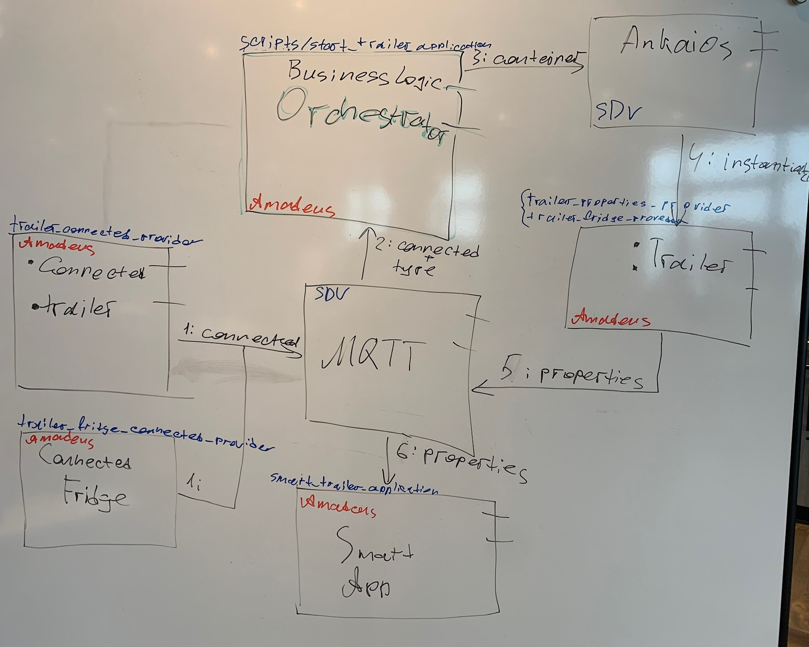
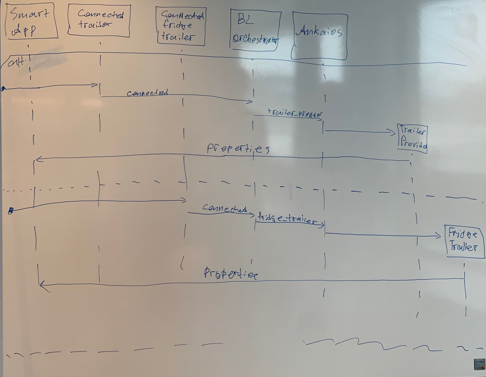

# Amadeus

> This project shows how the (software) infrastructure of the car adapts to different environment settings

Setting: Vehicle which is capable to get trailiers attached

Question: Is it possible that the software in the car adapts to the attached trailiers

Scenario:

Two different trailers: One basic trailer and one with a fridge.

- When a basic trailer is connected, the weight of the trailer is sent.
- When the trailer of the fridge is connected, additionaly, the temperature is sent.

## CI-Checks

- Basic Dockerfile build checks as well as integration tests: <https://github.com/Eclipse-SDV-Hackathon-Accenture/amadeus/blob/main/.github/workflows/check.yml>
- Linting of files: <https://github.com/Eclipse-SDV-Hackathon-Accenture/amadeus/blob/main/.github/workflows/lint.yml>

See <https://github.com/Eclipse-SDV-Hackathon-Accenture/amadeus/actions> for the current checks.

## Architecture

## Sequence  Diagram

## Links

- The basic settinsg is written at <https://github.com/Eclipse-SDV-Hackathon-Accenture/maestro-challenge>.
